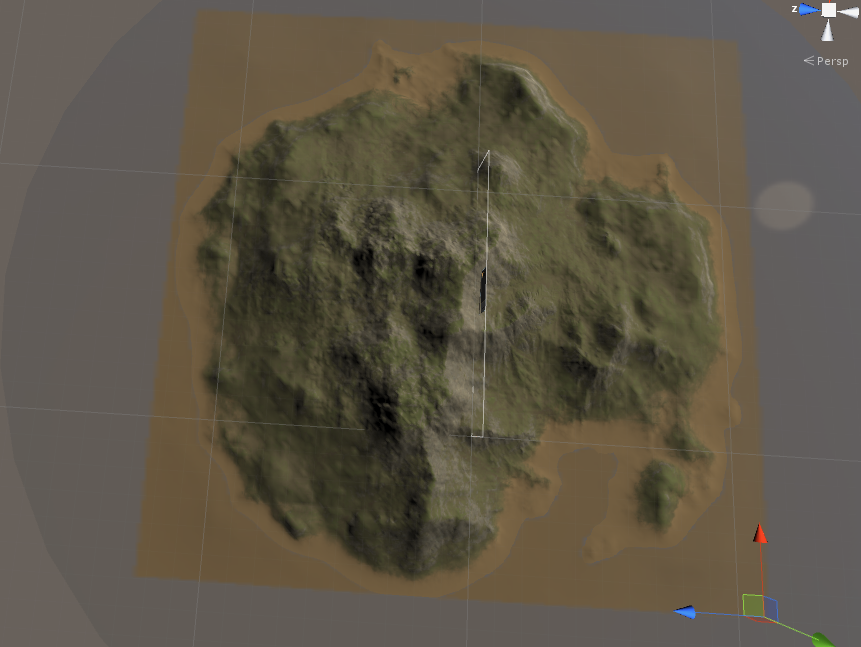
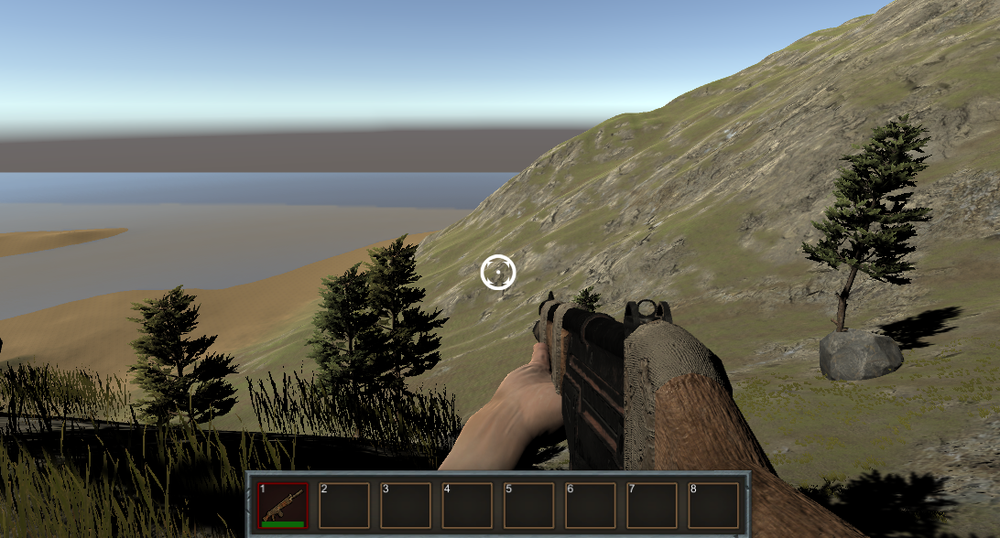

# **沙盒Demo**
展示一个沙盒游戏的各模块建造过程.
***

## **一、UI模块**
### **1、背包**

* **打开面板**
> 按 I 打开/关闭面板.

* **拆分物品**
> 大量物品可以拆分，按右键半数拆分

### **2、合成**

* **合成物品**
> 把物品拖动到合成面板对应位置，点击合成，合成后剩余材料自动放回背包内.

### **3、工具栏**

* **切换工具栏**
> 可以把背包中的物品拖到工具栏，然后按数字键1~8切换工具.

***

## **二、FPS模块**
### **1、建造**
> 按 M 切换成建造模式.（默认）

### **2、枪械**
* **长矛**
> 按 K 切换成长矛模式.
> 右键瞄准，左键射击，射出的长矛尾部具有颤动效果.

* **弓箭**
> 右键瞄准，左键射击，射出的箭矢尾部具有颤动效果.

* **猎枪**
> 右键瞄准，左键射击，瞄准期间可以连续射击.

* **霰弹枪**
> 右键瞄准，左键射击，瞄准期间只能射击一次，然后弹出弹壳.

* **耐久度**
> 枪械具有耐久度，耐久将逐渐降低，为0时则销毁枪械.

***

## **三、环境模块**
### **1、地形**
> 该地形是一个小岛，具有山坡，火山口，湖泊，草地，沙滩等部分。

### **2、物体**
> 环境物体具有hp，受到伤害使hp低于0时将消失。
> 破坏环境后获得材料，破坏树木获得木材，破坏石头获得石块。

***

## **四、AI模块**
### **1、寻路**
> 怪物自动寻路。目前怪物只包括小猪与僵尸。

*最新更新于 2018.12.10

